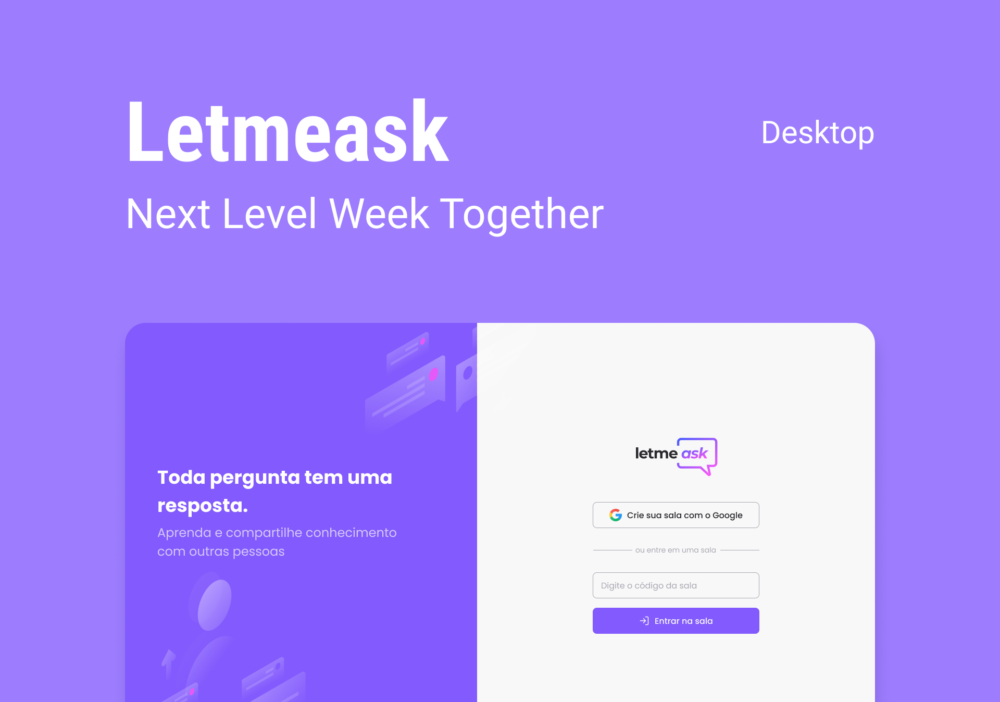

<p align="center">
  
</p>

Let Me Ask é uma plataforma construída para permitir que você crie salas de perguntas e respostas, desenvolvida durante o  **NLW - Next Level Week #6** da [Rocketseat](https://rocketseat.com.br/)

<h1 align="center">
    
</h1>

<br>

## ⚒️  Tecnologias

Este projeto foi desenvolvido utilizando as seguintes tecnologias:

- [React](https://reactjs.org)
- [Firebase](https://firebase.google.com/)
- [JavaScript](https://www.javascript.com/)

## 🚀 Executando o projeto

```bash
# Clone este repositório
$ git clone https://github.com/brunodias77/letmeask.git

# Acesse a pasta do projeto no seu terminal/cmd
$ cd letmeask

# Lembre-se de configurar seu .env.local com as informações de sua conta no firebase seguindo o .env.exemple

# Instale as dependências
$ yarn install
# ou npm install

# Execute a aplicação em modo de desenvolvimento
$ yarn start
# ou npm run start

# A aplicação será aberta na porta:3000 - acesse http://localhost:3000
```


## Layout


- [Layout Figma](https://www.figma.com/file/u0BQK8rCf2KgzcukdRRCWh/Letmeask/duplicate) 


## 📝 Licença

Este projeto esta sobe a licença [MIT](LICENSE.md) 

---

<p align="start">Feito por Bruno Dias 👋🏻 </p>

[](https://www.instagram.com/dias.developer/)

[](https://twitter.com/brunohdias95)
